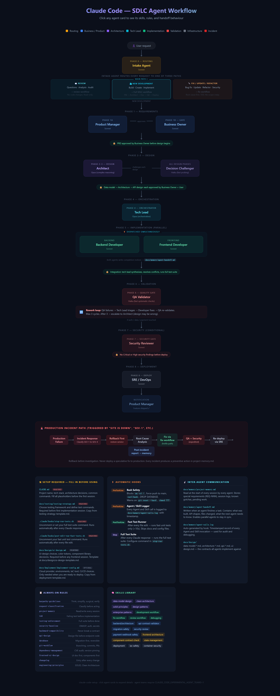

# Claude Code Setup

A general-purpose `.claude/` configuration that gives any project a fully automated SDLC workflow powered by a team of Claude agents — from requirements to production.

---

## Workflow Visualization

Click the image to open the interactive version (click agent cards to expand details):

> **To generate the screenshot:** open `docs/workflow-visualization.html` in Chrome → F12 → Ctrl+Shift+P → "Capture full size screenshot" → save as `docs/workflow-preview.png`.
>
> **Live interactive view:** [Open workflow in browser](https://htmlpreview.github.io/?https://github.com/V1ncenTNg02/claude-code-setup/blob/main/docs/workflow-visualization.html)
>
> **With GitHub Pages enabled:** [https://V1ncenTNg02.github.io/claude-code-setup/docs/workflow-visualization.html](https://V1ncenTNg02.github.io/claude-code-setup/docs/workflow-visualization.html)

---

## What it does

Every request is classified into one of three paths:

| Path | When | Workflow |
|---|---|---|
| **REVIEW** | Questions, analysis, audits | Read-only — no code changes |
| **NEW DEVELOPMENT** | Building something new | Full SDLC: PM → Architect → Dev → QA → Deploy |
| **FIX / UPDATE / REFACTOR** | Changing existing code | Root cause first, TDD, bounded scope |

For new features, a team of 12 agents runs the full cycle — PM writes the PRD, Architect designs the data model and API contracts, Tech Lead dispatches Backend and Frontend developers in parallel, QA validates, Security reviews, and SRE deploys.

---

## Quick start

1. Copy this `.claude/` folder into your project root
2. Fill in `CLAUDE.md` — project name, tech stack, architecture decisions, common commands
3. Fill in `docs/testing/testing-strategy.md` — choose your test framework and commands
4. Edit `.claude/hooks/stop-run-tests.sh` — uncomment the test command for your stack
5. Edit `.claude/hooks/post-edit-run-fast-tests.sh` — uncomment the fast unit test command
6. Open Claude Code in your project and start working

See [`.claude/README.md`](.claude/README.md) for the full agent team guide.

---

## Agent team

| Agent | Role | Model |
|---|---|---|
| Intake | Classifies every request | Sonnet |
| Product Manager | PRDs, acceptance criteria | Sonnet |
| Business Owner | Approval gates | Sonnet |
| Architect | Data model, architecture, API contracts | Opus |
| Decision Challenger | Devil's advocate on every design | Haiku |
| Tech Lead | Orchestrates parallel workstreams | Opus |
| Backend Developer | API, services, database, TDD | Sonnet |
| Frontend Developer | Components, pages, state | Sonnet |
| QA Validator | Validates all acceptance criteria | Haiku |
| Security Reviewer | OWASP audit, blocks on Critical/High | Sonnet |
| SRE / DevOps | Deployment, infra, CI/CD | Sonnet |
| Incident Response | Production failures, RCA | Opus |
